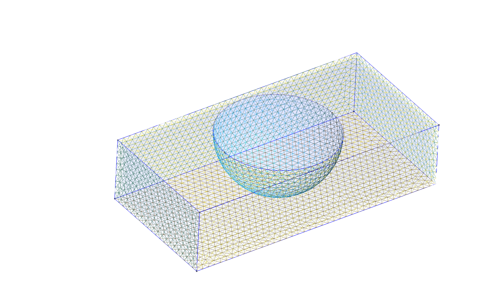
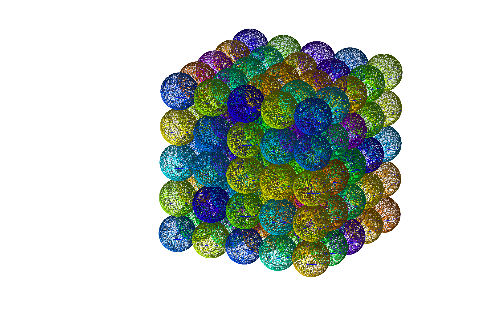
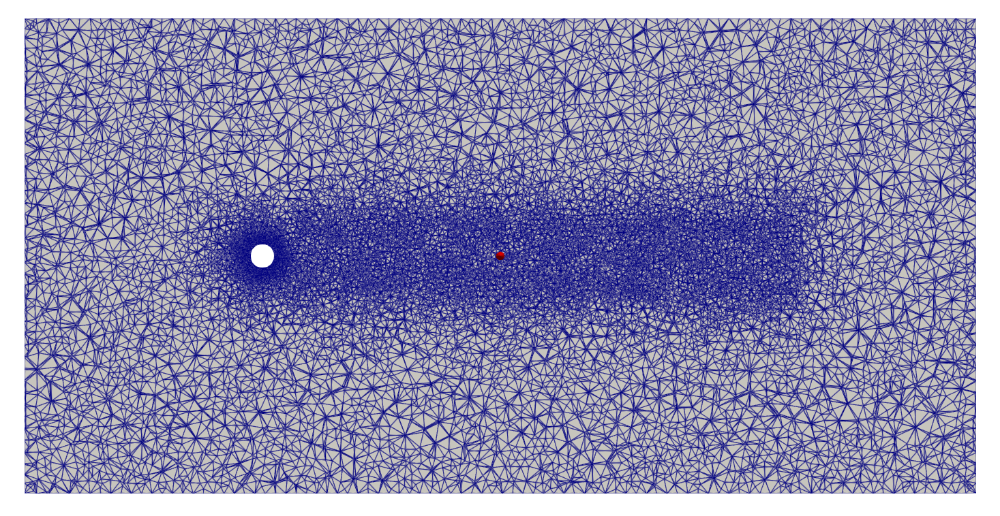

# geo2mes
gmshによるファイルを有限要素解析に利用可能な形式にするためのツール一式


## 環境構築

1. このプロジェクトをクローンする
```
git clone git@github:/reikanomura/geo2mes.git
```
ここで躓いてしまったらgitに詳しそうな人，femfluid.gitの管理者に連絡をする

2. 次のコマンドを順番に実行（コピペ実行可）
```
mkdir -p ~/.gmsh;
echo "PATH=${PATH}:~/.gmsh" >> ~/.bashrc
source ~/.bashrc
```
上記がうまくできたら次を実行
```
cd begin_gmsh
make; cp geoget ~/.gmsh; cp tagget ~/.gmsh; cp geo2mesh ~/.gmsh
chmod 550 ~/.gmsh/geoget; cp GEO2MESH.py ~/.gmsh; 
```

3. 次のコマンドを実行してみて，`sample.geo`という名前のファイルが手元に現れたら成功
```
geoget
```

## 使い方

### その１：.geoファイルから.mesh形式のファイルを作成する

##### 解析領域（ジオメトリ）をgmshの.geoファイルで作成する

GUIベースでの操作，CUIベースでの操作の２通りの作成方法があります．  
慣れないうちはGUIベースで操作，慣れてきたらCUIベースでの操作に移りましょう．

```
geoget
gmsh sample.geo
```
というコマンドをうち，gmshの画面が立ち上がったら，動画の真似をしてみましょう．


- GUIでの操作（マウスを動かして地道に作る）
  [gmsh screencast](http://gmsh.info/screencasts/)にまとめられている動画を見るとだいたいのことがわかるぞい

- CUIでの操作（.geoファイルを直接編集する）

  慣れていないうちは，`sample.geo`をダウンロードして，それに書き加える形で編集すること！
  **Mesh.**で始まる指定文は，意味が解らないうちは書き換えないこと


##### gmshコマンドでメッシング
input.geoというファイルに対して，３次元メッシュ分割したい場合は

```python
python GEO2MESH.py input.geo --dim 3
```

２次元メッシュ分割の場合は

```python
python GEO2MESH.py input.geo --dim 2
```

もしも，メッシュが細かく，メッシングに時間がかかりそうなときは，スレッド並列化することもできる．３次元メッシュ分割で，8スレッド並列したい場合は

```python
python GEO2MESH.py input.geo --dim 3 --threads 8
```

コードの実行が完了したらvtkファイルと，.mesh形式のファイルが出力されているはず
paraviewを立ち上げ，input.vtkを読み込み，メッシュが期待通りに切れているか確認する


### その３：メッシュファイル形式に変換する

たとえば3次元の解析で`sample.mesh`を変換したいときは，
```
MESH2MES 3 sample
```
とコマンドを打つ．このあとに，4か6を入力するよう指示文が現れるので，
4をタイプするとメッシュ変換ができる

2次元の解析で，`test.mesh`というファイルを変換したいときは
```
MESH2MES 2 test
```
とうつ．３か４のどちらかを入力するよう指示分が現れるので，
三角形要素を変換したいときは３を，矩形要素を変換したいときは４をうつ．


上記の実行で出来上がったファイル（`hogehoge-mesh.bin`や`hoge.mes`など）は，`mkbc.f90`で読み込むことができる形式になっている．

#### その４：（３次元解析で必要であれば）境界条件が課される節点番号の抽出

 作成したジオメトリがとても複雑で，すべりなし境界条件（non-slip）を課したい面が複雑な形状をしている場合，  
 mkBCnodes.f90を利用して，すべりなし境界条件面上の節点情報を抽出することができる．  

  1. 下記のようなフォーマットの `imput.tag` ファイルを用意する．inputの箇所は自分の.meshファイルの名前に応じて変える:

  ```
    #1 1ST_SURFACE_TAG   
    #2 2ND_SURFACE_TAG  
    #3 3RD_SURFACE_TAG  
    ....  
    #N N-th_SURFACE_TAG  
  ```
  サーフェスタグの確認は，gmshをGUIで立ち上げて確認するのが便利

  2. 
  ```
  mkBCfile input 
  ```
  を実行すると，'input-bc.txt'というファイルが出来上がる．このファイルには，指定したサーフェスタグに属する節点のIDがすべて格納されている

#### その５：CUIでの操作方法

頻繁に用いる機能について説明しておきます．  
ここでは，簡単な説明に留めておくので，詳細は各練習問題を参考にしてください．

##### Boolean
全領域から障害物の領域を取り除き，流体領域を生成する機能  
サーティワンで箱からアイスをくり抜く状況をイメージすれば良い．
  ```
    // Make rectangle channel
    v_in  = newv; Box(v_in) = {x_sta, y_sta, z_sta, dx, dy, dz};

    // Make sphere
    v_ball = newv; Sphere(v_ball) = {0.5, 0.5, 1.0, 0.45};

    // Boolean
    v() = BooleanDifference{Volume{v_in}; Delete;}{Volume{v_ball}; Delete;};
  ```



##### オブジェクトの複製
同じ形状のオブジェクトをコピーして配置する際に用いる．  
以下の練習問題では．球をX，Y，Zの各方向に5つずつ複製している．

  ```
  // Make sphere
  v_ball = newv; Sphere(v_ball) = {0.5, 0.5, 0.5, dd/2};

  // Make Sphere arrays
  dx = dd;
  dy = dd;
  dz = dd;

  For i In {1:4}
    Translate{dx, 0, 0} { Duplicata{ Volume{v_ball}; } }
    dx += dd;
  EndFor

  For i In {1:4}
    Translate{0, dy, 0} { Duplicata{ Volume{13:17:1}; } }
    dy += dd;
  EndFor

  For i In {1:4}
    Translate{0, 0, dz} { Duplicata{ Volume{13:37:1}; } }
    dz += dd;
  EndFor
  ```



##### 指定領域のメッシュサイズ変更
Field機能を用いれば，任意の領域だけメッシュサイズを変更することができる．

  ```
// 例えば，球形の領域のメッシュ解像度を変更する場合には，次のように指定する．
Field[1] = Ball;
Field[1].Radius = 7.5;
Field[1].VIn = lc / 8;
Field[1].VOut = lc;
Field[1].XCenter = 100;
Field[1].YCenter = 100;
Field[1].ZCenter = 100;
Field[1].Thickness = 30;

// 同様に，箱型の領域を細分化する場合には，次のように指定すれば良い．
Field[2] = Box;
Field[2].VIn = lc / 3;
Field[2].VOut = lc;
Field[2].XMin = -15+100;
Field[2].XMax =  15+100;
Field[2].YMin = -15+100;
Field[2].YMax =  15+100;
Field[2].ZMin = -85+200;
Field[2].ZMax =  120+200;
Field[2].Thickness = 30;

// Min Fieldでどのフィールドを適用するか指定する．
Field[3] = Min;
Field[3].FieldsList = {1,2};
Background Field = 3;
```
ただし，Field機能を用いる場合には，下記の文章を.geoファイルに追記する必要がある．
 ```
Mesh.MeshSizeExtendFromBoundary = 0;
Mesh.MeshSizeFromPoints = 0;
Mesh.MeshSizeFromCurvature = 0;
 ```



##### 周期境界条件の設定
Periodic surfaceやPeriodic Line昨日を使うことで周期境界メッシュを切ることができる．
下記の場合サーフェス4はサーフェス2をdy分だけ移動させた位置にあり，この２つが周期境界面として対になっている
 ```
Periodic Surface {4} = {2} Translate {0, dy, 0};
 ```
